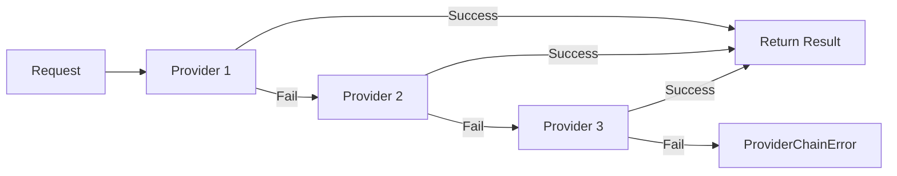

# Provider Chains

Provider chains allow automatic fallback between multiple providers for reliability and cost optimization.

---

## Quick Start

```python
from strutex import DocumentProcessor, ProviderChain, local_first_chain

# Use a pre-built chain
processor = DocumentProcessor(provider=local_first_chain())

# Or create a custom chain
from strutex import GeminiProvider, OllamaProvider, OpenAIProvider

chain = ProviderChain([
    OllamaProvider(model="llama3.2-vision"),  # Try local first
    GeminiProvider(),                          # Then Gemini
    OpenAIProvider()                           # Finally OpenAI
])

processor = DocumentProcessor(provider=chain)
```

---

## How It Works

When you call `process()` on a ProviderChain:

1. The first provider attempts the extraction
2. If it fails (any exception), the chain moves to the next provider
3. Process continues until one succeeds or all fail
4. If all fail, raises `ProviderChainError` with details



---

## Pre-built Chains

### local_first_chain()

Prefers local/free providers:

```python
from strutex import local_first_chain

chain = local_first_chain()
# Order: Ollama → Gemini → OpenAI
```

### cost_optimized_chain()

Ordered by cost (cheapest first):

```python
from strutex import cost_optimized_chain

chain = cost_optimized_chain()
# Order: Ollama (free) → Gemini → Anthropic → OpenAI
```

---

## Custom Chains

### Using Provider Instances

```python
from strutex import ProviderChain, OllamaProvider, GeminiProvider

chain = ProviderChain([
    OllamaProvider(model="llama3.2-vision", timeout=30),
    GeminiProvider(model="gemini-2.5-flash")
])
```

### Using Provider Names

```python
from strutex.providers import create_fallback_chain

# Resolves provider names automatically
chain = create_fallback_chain("ollama", "gemini", "openai")
```

---

## Fallback Callbacks

Get notified when fallback occurs:

```python
def on_fallback(provider, error):
    print(f"Provider {provider.__class__.__name__} failed: {error}")
    # Log, send alert, etc.

chain = ProviderChain(
    providers=["ollama", "gemini"],
    on_fallback=on_fallback
)
```

---

## Tracking Which Provider Succeeded

```python
chain = ProviderChain(["ollama", "gemini", "openai"])

result = chain.process(file_path, prompt, schema, mime_type)

# Check which provider was used
print(f"Used: {chain.last_provider.__class__.__name__}")
```

---

## Async Support

```python
import asyncio

async def extract():
    chain = ProviderChain(["ollama", "gemini"])
    result = await chain.aprocess(file_path, prompt, schema, mime_type)
    return result

result = asyncio.run(extract())
```

---

## Error Handling

```python
from strutex.providers import ProviderChain, ProviderChainError

chain = ProviderChain(["ollama", "gemini"])

try:
    result = chain.process(...)
except ProviderChainError as e:
    print(f"All providers failed: {e}")

    # Access individual errors
    for provider, error in e.errors:
        print(f"  - {provider.__class__.__name__}: {error}")
```

---

## Available Providers

| Provider            | Cost | Priority | Capabilities             |
| ------------------- | ---- | -------- | ------------------------ |
| `OllamaProvider`    | 0.0  | 40       | vision, local            |
| `GroqProvider`      | 0.3  | 45       | fast, vision             |
| `GeminiProvider`    | 1.0  | 50       | vision                   |
| `AnthropicProvider` | 1.5  | 55       | vision, large_context    |
| `OpenAIProvider`    | 2.0  | 60       | vision, function_calling |

---

## Best Practices

1. **Put cheapest/fastest providers first** for cost optimization
2. **Put most reliable providers last** as final fallback
3. **Set appropriate timeouts** on each provider
4. **Use callbacks** to log/alert on failures
5. **Check `last_provider`** to understand usage patterns
